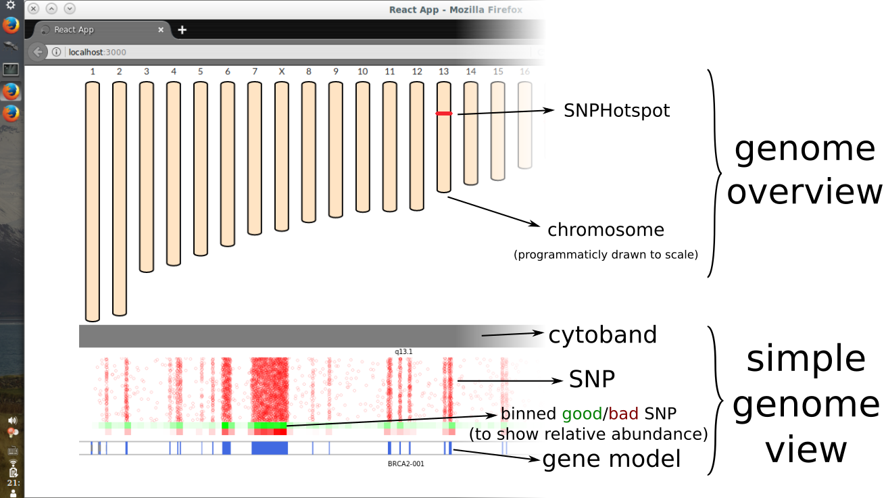
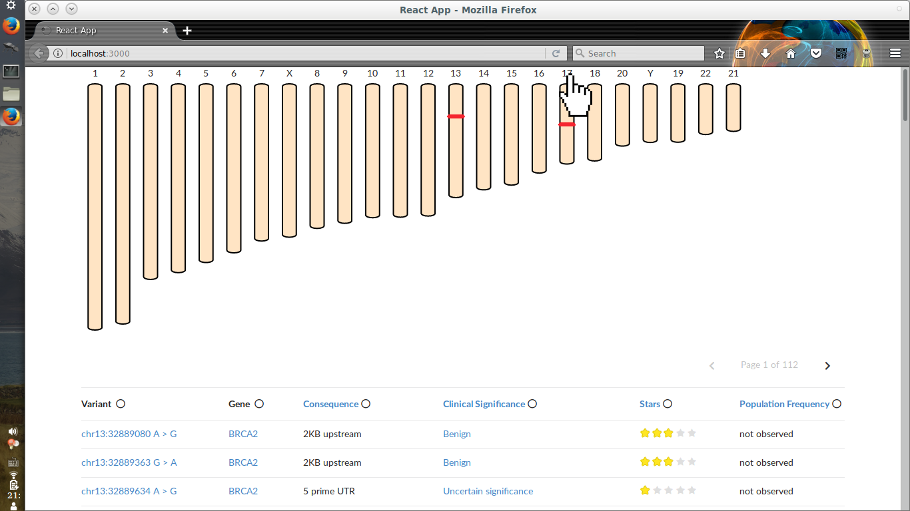
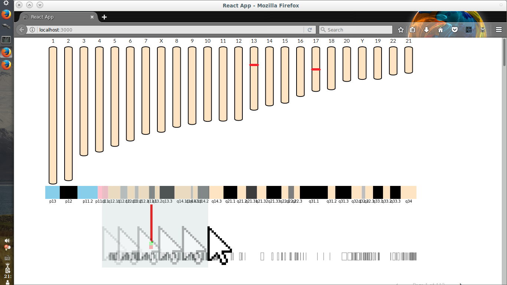

This repository contains 2 HTML widgets I initiated for Broad Institute coding interview. I did not have much time working on them, and I do not have time to evolve them further currently.

# Design

I adopted a plugin-friendly design pattern where the main widgets only control coordinates and all other plugins do the drawing. For example, if a plugin want to draw a gene at chrmosome X, xxx bp - yyy bp, the plugin queries the main widget the coordinates for ChrX:xxx and ChrX:yyy on drawing canvas, and then the plugin can draw a rectangle, possibly with rounded corner.

This design allows a high degree of flexibility and extensibility.

This design is adopted from __dygraphs.js__, a great plotting library.

# Overview of 2 widgets

The visualization of clinvar data contains 2 part. A genome overview and a simple genome view, all programmatically drawn as svg or canvas. 

</img>

## Usage:

__Chromosome selection__:

Upon loading the page, you are greeted with the "genome overview" only. You can click on chromosome label to select your chromosome of interest.

</img>

__Zooming in__:

Drag along the "simple genome view" to zoom in to desired region.

</img>

__Unzoom__:

Double click on the "simple genome view" to unzoom.

## Implementation:

Two widgets (`GenomeOverviewer.js` and `SimpleGenomeViewer.js`) are implemented, each with a primitive plugin design.

The two widgets are written in vanilla JavaScript ES6.

## Dev/Test environment

* npm: 5.8.0
* python: 3.6.6 (under conda environment)
* python-flask: 1.0.2
* firefox: 52.9.0

## Liscence

LGPLv3 for `GenomeOverviewer.js`, `SimpleGenomeViewer.js` and all related plugins.
